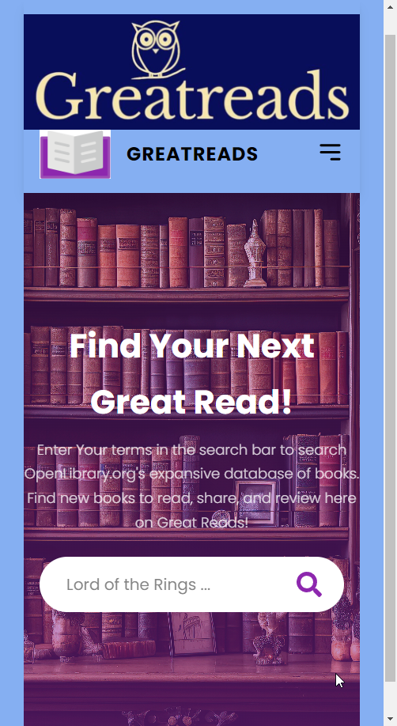
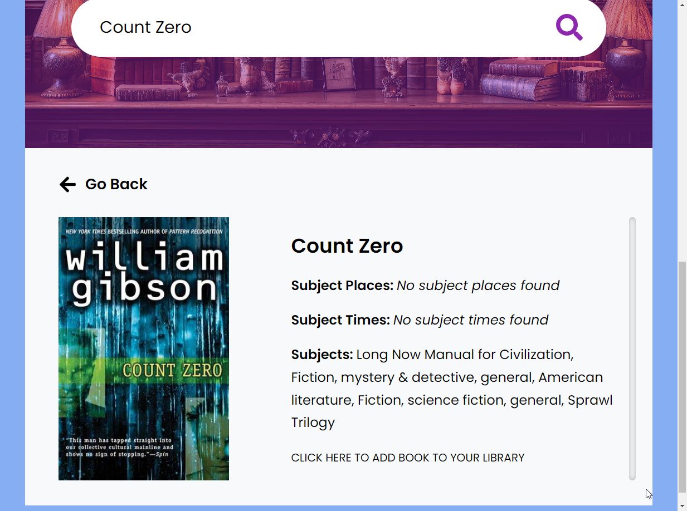
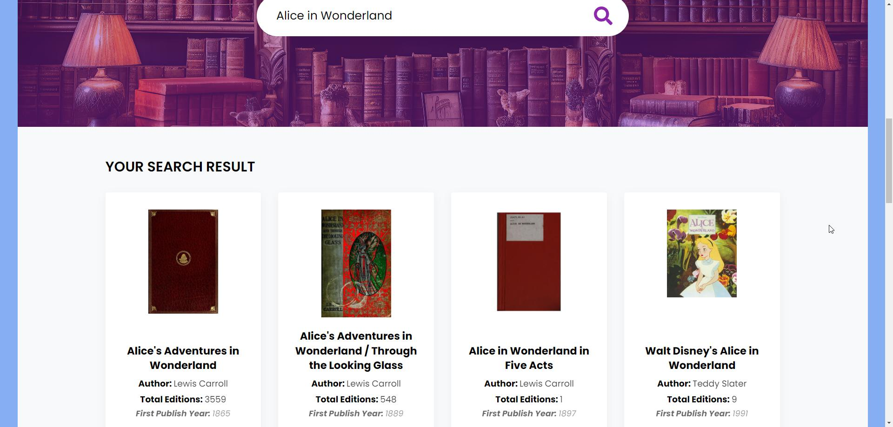
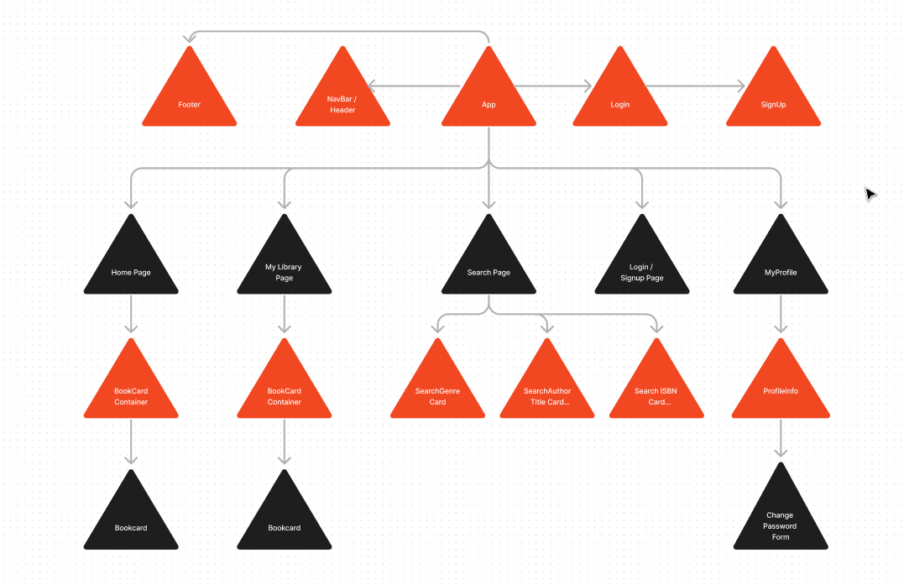
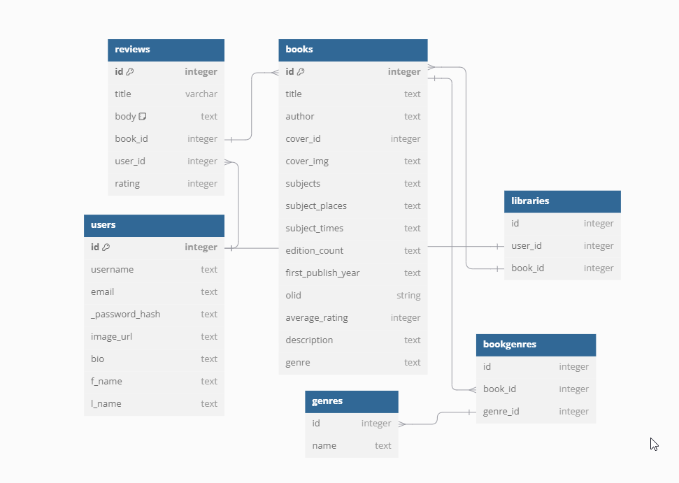

# Welcome to GreatReads!

GreatReads is a book-finding web application which leverages the [Open Library API](http://openlibrary.org/developers/api) to allow users to discover new books by searching by Title, Author, or IBSN.  

## Table of Contents

## Wireframe (coming soon, for now, screenshots)

## Github

Get the latest version of the project [On our Github Page](https://github.com/krichlin/GreatReads)

## User Stories

New users to the site will be greeted by the Login Page.  They will be invited to login to the site with their credentials, or to click on Sign Up to create a new account.

After account creation and login, users will be able to search the Open Library database by typing into the search bar.  The search will return relevant books by Author, Title, or ISBN.  These search results (up to a maximum of 20) will populate at the bottom of the search page, and display some key information about the books.

Users can click on a book's title to bring up a details page, showing additional details about the book including info about Locations, Times, and subjects.  The details page will have a link which adds this particular book to the user's private library.

A Navbar at the top of the page will allow navigation to other pages, including My Library.

Manage your library by adding new books or removing books you don't like anymore.  Read and leave Reviews and Ratings for books in your library.  Edit (Update) or Delete any reviews you've already written.  

## React Tree Diagram

## Screenshot of our DB Schema

## API Routes (includes HTTP Verb, Endpoint, Purpose)

- Home, '/', Server Home Page which displays menu of routes
- CheckSession, get, '/check_session', Check to see if user is logged in.
- Signup, post, '/signup', create a new user
- Login, get, post, '/login', authenticate user and login
- Logout, delete, '/logout', log out current user
- AllBooks, '/allbooks', Returns all the book objects in db
- Users, get, '/user', Return a list of all users
- UserById, get, '/user/<int:id>', Returns profile page of specific user
- AddBook, post, '/addbook', Add a book to your library
- Books, get, '/books', Return a specific book
- BookById, get patch delete, '/books/<int:id>', Return a book by ID, Update a book by ID, Delete a book by ID
- Firstbook, get, '/firstbook', returns only the first book in libary.  for testing purposes

## Stretch Goals

    Input Validation - password rules for length and special characters
    Deploy project with Vercel (front) and Render (back).  Migrate DB to PostgreSQL in the process.
    Port project in React Native for deployment on mobile devices
    Use ChatGPT to create an AI powered book reccomendation engine based on users library, trained on all users libraries.

## Kanban board

Check out our [Github Project Page](https://github.com/users/krichlin/projects/1)

## What new tech will we be using, and how?

   * 📄 HTML5
   * 🌈 CSS3
   * 🟨 JavaScript
   * React
   * Python
   * Flask
   * SQLite

### API's Used

We use the [OpenLibrary API](http://openlibrary.org/developers/api).

## Packages Used

### Frontend Packages (JavaScript and React)
* React Router - To integrate navigation in a single page web app.
* React Icons - For pretty buttons
* React Redux - For state management of user
* React Bootstrap - For Styling
* Formik - For Login and Signup forms
* Yup - For Validation and Error Handling of login and signup

### Backend Packages (Python and Flask)
* SQLAlchemy 
* Flask RESTful
* Bcrypt - Password encryption and salting

## Setup Instructions

### Back End
- To initialize the environment, enter the server directory, and type `pipenv install && pipenv shell`
- Enable bcrypt by typing `pip install flask-bcrypt` (May not be necessary if requirements set correctly?)
- Don't forget to `import validators` (May not be necessary if requirements set correctly?)
- Upgrade the db by typing `flask db upgrade head`
- Populate the db with some test data by running `python seed.py` (maybe move this to config script to skip this step when we deploy?)
- For deployment code only, don't forget to run `pip install python-dotenv` to set up the enviornment.
- Start the server by typing `python server/app.py` (change this after deployment)

### Front End
- In a new terminal window, enter the client directory and type `npm install` to install necessary packages.
- To start the JSON server, enter /client directory and type `json-server --watch db.json --port 4000`
- check `localhost:4000/users` for JSON data
- To Launch, Open a new termainl window, enter the client directory and type `npm start` 